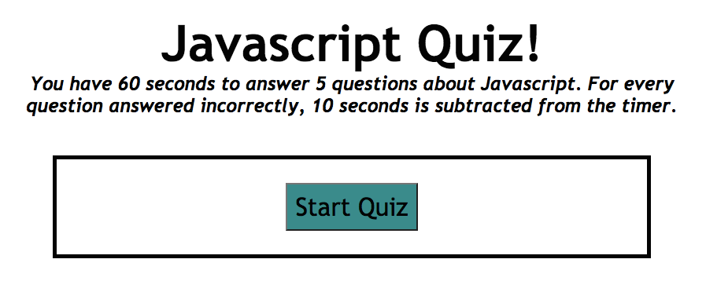

# Code Quiz Assignment

## Description
The goal of this project was to create a multiple choice quiz about Javascript. When a correct answer is selected, one point is added to the score. When an incorrect answer is selected, ten seconds is subtracted from the timer. At the end of the quiz there is an option to add a name so that the score can be stored. 

## Installation

Visit this link to view the code quiz: https://abbeyschu.github.io/homework4_AS/

## Screenshots

Initial Quiz Screen:

## License 

[MIT](https://github.com/abbeyschu/homework4_AS/raw/main/assets/license.txt)
